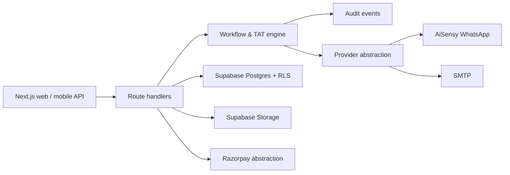
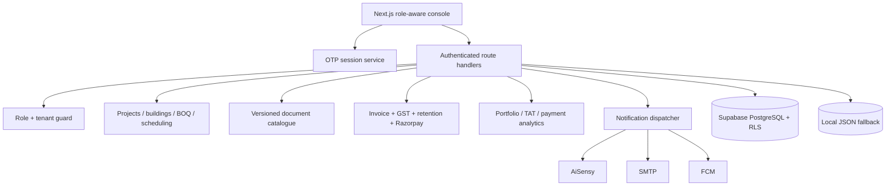

# FOXSCAN

Workflow-first project management for residential society painting, waterproofing and allied works. This repository implements the PRD's MVP and V1 scope with a usable credential-free local mode and Supabase-ready production schema.

## Run locally

```bash
cp .env.example .env.local
pnpm dev
```

Open `http://localhost:3000`. The first visit seeds an isolated pilot tenant; application data is saved in `data/foxscan.json` (gitignored). This makes core workflow, payment tracking, site logs, audit records, and admin diagnostics usable without vendors or cloud credentials.

## Integration architecture

Each provider is behind `lib/integrations.ts`. Its status is visible in the Admin panel and switches to live mode entirely through environment variables:

- WhatsApp: AiSensy (`AISENSY_API_KEY`)
- Email: SMTP (`SMTP_*`)
- Push: Firebase (`FIREBASE_*`)
- Payments: Razorpay (`RAZORPAY_*`)
- Storage: Supabase Storage (`NEXT_PUBLIC_SUPABASE_URL`, `SUPABASE_SERVICE_ROLE_KEY`)

When unconfigured, durable in-app/local provider behavior is retained and explicitly reported; no workflow action is blocked by missing credentials.

## Production database

Apply `supabase/migrations/0001_foxscan.sql` through the Supabase CLI. It contains tenant-aware entities, checks, indexes, append-only audit controls, and RLS access policies. Production deployment should set `FOXSCAN_DATA_MODE=supabase` and bind repository operations to the migration schema.

## Architecture



## Phase 2 architecture



### Authentication and RBAC

`POST /api/auth/otp` provides a challenge and session flow. In local development, the OTP is deliberately deterministic (`123456`) to keep the product usable with no SMS provider. Production OTP delivery must be connected to a configured SMS/WhatsApp provider and does not return the code. Protected endpoints consume `Authorization: Bearer <session>` and enforce the caller role and tenant.

### Phase 2 APIs

- `/api/projects` — tenant-scoped setup
- `/api/activities` — guarded scheduling and dependency validation
- `/api/invitations` — role invite workflow
- `/api/documents` — access-filtered search and versioned records
- `/api/invoices` — GST/retention invoice calculation and payment release
- `/api/reports` — portfolio, payments and TAT metrics

### Tests and verification

The test suite covers OTP/session verification, RBAC rejection, approval-chain transitions, and critical-path selection. Run `pnpm test`; build with `pnpm build`.

## Core workflow

`Contractor raises evidence → Manufacturer review → Consultant approval → Client releases payment`. Any reviewer may return a stage for rework; all decisions are attributable and audited. TAT due dates are recorded at submission and exposed in role dashboards.
